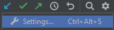

# Installation de Python et de son environnement de développement

## Windows (depuis un compte **administrateur**)

### Installation de python

Pour savoir si Python est installé et si l'exécutable est dans le "PATH", depuis
une console Windows, taper : 
```
python --version
```
Si la commande est reconnue, Python est bien installé.

Sinon, pour installer Python, il suffit de télécharger le programme d'installation sur le 
site de [Python](https://www.python.org/downloads/windows/) 
(_téléchargez la version 3 de Python et non la version 2 !_).

Lancez le programme d'installation. **De préférence**, installez python dans un répertoire "_non système_", 
du style `C:\Python\` pour éviter les problèmes d'installation de paquetages sans être administrateur...

### Installation de Jupyter

Il existe deux versions de Jupyter : 
- **JupyterLab** : C'est l'environnement complet de Jupyter permettant de 
  créer des pages, de visualiser le rendu, etc.
- **Jupyter Notebook** : C'est la version _light_ permettant de visualiser/utiliser
  les pages de Jupyter.

#### Installer JupyterLab

[Source](https://jupyter.org/install)

Une fois Python installé, l'installation de **JupyterLab** est très facile : Il suffit 
de taper : 
```
pip install jupyterlab
```

Pour lancer ensuite **JupyterLab**, il suffit de taper : 
```
jupyter-lab
```

#### Installer Jupyter Notebook

Une fois Python installé, l'installation de **Jupyter Notebook** est très facile : Il suffit 
de taper : 
```
pip install notebook
```

Pour lancer ensuite **Jupyter Notebook**, il suffit de taper : 
```
jupyter notebook
```

Depuis la version 10 (ou moins ?) de Python, il faut taper : 
```
jupyter-notebook
```

### Installation de **PyCharm**

**PyCharm** est un environnement de développement pour Python (et accessoirement
HTML, JS et SQL selon la version choisie - professionnelle ou _Open Source_).

Pour installer **PyCharm**, il suffit de télécharger le programme d'installation depuis
le site [JetBrains](https://www.jetbrains.com/pycharm/) et de l'exécuter.

## Linux

### Installer Python

Sous Linux, l'installation/utilisation de Python n'est pas aussi facile que sous Windows.

Par défaut, Python est déjà installé sur le système, sauf que les deux versions principales
de Python sont installées ! Python 2 et Python 3 !

Donc, pour vérifier que Python 3 est bien installé sur le système, il faut taper : 
```
python3 --version
```

Si Python n'est pas installé, il faut aller chercher l'archive sur le site de 
[Python](https://www.jetbrains.com/pycharm/) et l'installer (**A tester**)...

### Installer l'environnement Jupyter

_Bizarrement_, si Python était déjà installé sur le système, il y a de fortes chances pour
que l'utilitaire `pip`, lui, ne  soit pas installé !
Pour l'installer, il faut taper :
```
sudo apt install python3-pip
```
(_Notez l'utilisation, à chaque fois, de **python3** pour sélectionner la version 3_)...

Pour vérifier que l'utilitaire a bien été installé, tapez :
```
pip --version
```

Pour installer **Jupyter**, il suffit de retaper les mêmes commandes que sous
Windows, avec deux possibilités : 
- *En mode normal*, les applications seront alors installées dans le répertoire
`$HOME/.local/bin`. Pour lancer les commandes, il faudra, soit ajouter ce répertoire 
  dans le `PATH`, soit taper : 
  ```
  ~/.local/bin/jupyter notebook
  ```
- *En mode administrateur*, en tapant : 
  ```
  sudo pip install notebook
  ```
  Dans ce cas, le serveur **Jupyter** peut être lancé directement avec la commande :
  ```
  jupyter notebook
  ```

### Installer PyCharm

Pour installer **PyCharm**, il faut télécharger l’archive depuis le site 
[JetBrains](https://www.jetbrains.com/pycharm/download/#section=linux).

L'archive correspond au programme. Il n'est pas nécessaire de compiler ou 
d'installer quoi que ce soit.

Une fois l'archive téléchargée, décompressez-la. Les instructions pour utiliser
**PyCharm** se trouvent dans le fichier `Install-Linux-tar.txt`. Le répertoire `pycharm-xxxx.y.z` 
peut être placé dans le répertoire `/opt/` par exemple. Dans ce cas, il faut ajouter
le chemin `/opt/pycharm-xxxx.y.z/bin/` dans la variable `$PATH`. Enfin, pour lancer
**PyCharm**, il suffira de taper : 
```
pycharm.sh
```

## Configurer PyCharm (Windows/Linux)

### Les commentaires

Par défaut, les commentaires, sous **PyCharm**, doivent être écrits en anglais.
Si vous voulez les écrire en français, il faut configurer **PyCharm** pour éviter
qu’il ne souligne chaque mot de vos commentaires.

Pour cela, cliquez sur l’icône  qui devrait se trouver
au-dessus des fenêtres en haut à droite puis sur le menu "Settings..." ().
Dans la fenêtre qui s'ouvre, sélectionnez les options : 
````
  Editor --> Proofreading
````
Dans la boîte des "Languages", ajoutez le dictionnaire français : 
> 

Enfin, sélectionnez l'option : 
```
  Editor --> Proofreading --> Grammar
```
Dans l'onglet `Rules`, décochez le dictionnaire anglais et cochez le dictionnaire français : 
> 

### Les conventions de notations

En TP, on vous a introduit la notation "_camel case_" pour nommer les variables
et les fonctions. Cette notation est reprise dans les langages comme PHP, Java, C#, etc.
Les noms commencent par des majuscules, le premier pouvant commencer par une minuscule : 
```
  unNomDeVariable
  UnNomDeClasse
```

Malheureusement, Python, de base, utilise la notation "_snake case_" pour nommer les 
méthodes/fonctions, notation qui consiste 
à n'utiliser que des minuscules et à les séparer par le caractère `_` : 
```
  un_nom_de_variable  # snake case
  un_nom_de_fonction  # snake case
  UnNomDeClasse       # camel case
```
Pour éviter que **PyCharm** ne souligne toutes vos fonctions ne respectant pas
le "_snake case_", dans les "_Settings_", sélectionnez les options : 
```
  Editor --> Inspection --> Python
```
Décochez l'option "_PEP 8 naming convention violation_" : 
> 

# Lancer les tests depuis *PyCharm*

Configurez un nouvel environnement d'exécution en cliquant sur le menu :
```
Run -->  Edit Configuration...
```
>

Dans la fenêtre qui s'affiche, ajoutez un nouvel environnement en cliquant sur le "`+`" et en sélectionnant
dans la rubrique "`tests Python`", les tests "`Unittests`" : 
>
>

Dans la nouvelle fenêtre qui s'affiche, ne sélectionnez **uniquement** que le nom du script `tests.py`
se trouvant dans le répertoire `tests/` en cliquant sur l'icône _`dossier`_ : 
>

Validez la fenêtre (bouton `OK`) et l'environnement d'exécution est créé.

Pour l'exécuter, il ne reste plus qu'à le sélectionner (si ce n'est pas déjà fait) et à cliquer 
sur le triangle vert : 
>

# Lancer les tests dans une console

Pour exécuter les tests depuis une console, il faut se placer dans le répertoire `tests/`
contenant le fichier ``tests.py``) et taper la commande : 
```
python -m unittest tests.py
```


